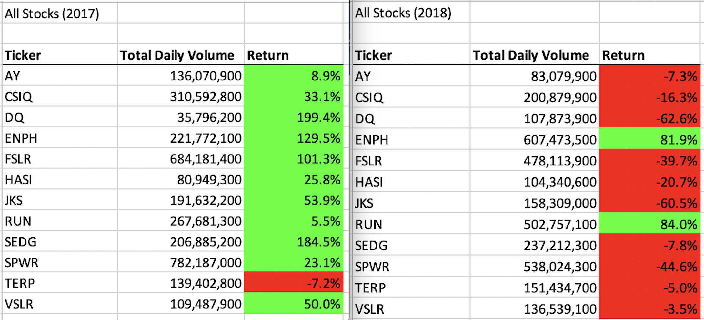

# Using VBA to Compare the Performance of a List of Stocks 
## Purpose of the project
###### To analyze the performance of 12 green industry stocks in 2017 and 2018 to determine the volume they traded at and their rate of return in both years, using VBA macros.
## Results
###### Stock performance
Our analysis shows that only two stocks in the client's set have positive returns for 2017 and 2018, ENPH and RUN. 
Based on this performance I would suggest the client only invests in ENPH and RUN out of this set of potential stocks. The same analysis could be performed on a larger sample of stocks to identify more competitive securities to broaden out the client's portfolio of holdings.  
###### Performance of the code
In order to be able to run the same analysis on a greater number of stocks for the client in future without increasing the run time we needed to refactor the code to make it run more efficiently. In order to do this we re-wrote the script to use a tickerIndex to loop through the data once, rather than the multiple times needed in the original code, to collect all of the data points to output in the final analysis.  

## Summary of refactoring
###### The pros and cons of refactoring code
###### Advantages
In this case, refactoring the code saved .27 seconds or 77% in run time on the 2017 sheet with similar results on the 2018 data.  
###### Potential Disadvantages
The downside of refactoring the code is that doing so adds coding time and introduces the chance of adding errors, but the result is a more flexible script that can be adjusted to add tickers and additional years of data with only small changes in the code required.

###### Challenges of refactoring this VBA project's script
By refactoring the code used in this project we have made it more flexible so that it can now run faster and handle larger data sets, including new stocks and more years of data without adding run time. Potential additions may be added to the code in future that would make it possible to input new sheets of data without needing to manually increase and name the array of tickers in the code. But as the code is now any new sheets containing new tickers would necessitate manually updating the array of ticker names in the code.

